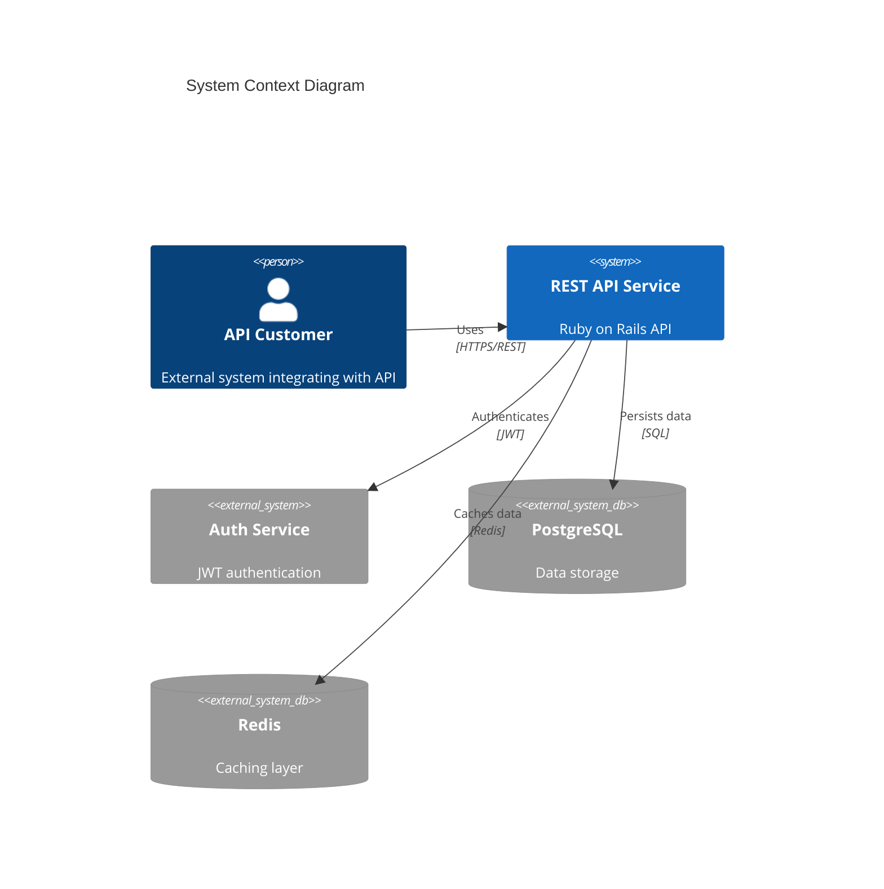

# Location and Job Management REST API

[](https://github.com/organization/project/actions)
[](https://codecov.io/gh/organization/project)
[](https://snyk.io/test/github/organization/project)
[](https://libraries.io/github/organization/project)

Enterprise-grade REST API service for managing locations and jobs, built with Ruby on Rails 7.x.

## System Requirements

- Ruby 3.2.0+
- PostgreSQL 14+ with PostGIS extensions
- Redis 6.2+ cluster configuration
- Docker 20.10+ and Docker Compose 2.0+
- Node.js 16+ for asset compilation
- Minimum 4GB RAM and 2 CPU cores

## Quick Start

1. Clone the repository and set up environment:
```bash
git clone https://github.com/organization/project
cd project
cp .env.example .env
```

2. Configure environment variables in `.env`:
```env
RAILS_ENV=development
DATABASE_URL=postgresql://postgres:postgres@db:5432/app_development
REDIS_URL=redis://redis:6379/0
JWT_SECRET=your_secure_jwt_secret
API_RATE_LIMIT=1000
RAILS_MAX_THREADS=5
RAILS_MIN_INSTANCES=2
```

3. Start development environment:
```bash
docker-compose up --build
```

## Architecture Overview

### Core Components
- RESTful API built with Ruby on Rails 7.x
- PostgreSQL 14+ database with read replicas
- Redis 6.2+ for caching and background jobs
- JWT authentication with role-based access
- Sidekiq for background processing
- NewRelic APM and Datadog monitoring

### System Architecture


## API Documentation

### Authentication
All API endpoints require JWT authentication:
```bash
# Login to obtain token
curl -X POST ${api_url}/auth/login \
  -H "Content-Type: application/json" \
  -d '{"email":"user@example.com","password":"password"}'

# Use token in subsequent requests
curl -X GET ${api_url}/api/v1/locations \
  -H "Authorization: Bearer ${jwt_token}"
```

### Core Endpoints

#### Locations
- `GET /api/v1/locations` - List locations
- `POST /api/v1/locations` - Create location
- `GET /api/v1/locations/:id` - Get location details
- `PUT /api/v1/locations/:id` - Update location
- `DELETE /api/v1/locations/:id` - Delete location

#### Jobs
- `GET /api/v1/jobs` - List jobs
- `POST /api/v1/jobs` - Create job
- `GET /api/v1/jobs/:id` - Get job details
- `PUT /api/v1/jobs/:id` - Update job
- `DELETE /api/v1/jobs/:id` - Delete job

## Development

### Directory Structure
```
.
├── app/
│   ├── controllers/    # API endpoints
│   ├── models/        # Database models
│   ├── serializers/   # JSON serializers
│   ├── services/      # Business logic
│   └── jobs/          # Background jobs
├── config/           # Application configuration
├── db/              # Database migrations
├── spec/            # Test suite
└── docker/          # Docker configuration
```

### Running Tests
```bash
docker-compose exec api bundle exec rspec
```

### Code Quality
```bash
docker-compose exec api bundle exec rubocop
docker-compose exec api bundle exec brakeman
```

## Deployment

### Infrastructure Requirements
- AWS ECS Fargate for container orchestration
- RDS PostgreSQL with read replicas
- ElastiCache Redis cluster
- CloudFront CDN
- Route 53 DNS management
- Application Load Balancer

### Production Environment Variables
```env
RAILS_ENV=production
DATABASE_URL=postgresql://<user>:<pass>@<host>:5432/<database>
REDIS_URL=redis://<host>:6379/0
JWT_SECRET=<secure_random_string>
RAILS_MAX_THREADS=25
RAILS_MIN_INSTANCES=2
NEW_RELIC_LICENSE_KEY=<key>
SENTRY_DSN=<dsn>
```

### Deployment Process
1. Build production image:
```bash
docker build -t api-service:latest --target production .
```

2. Push to registry:
```bash
docker tag api-service:latest <registry>/api-service:latest
docker push <registry>/api-service:latest
```

3. Deploy to ECS:
```bash
aws ecs update-service --cluster production --service api-service --force-new-deployment
```

## Security

### Authentication & Authorization
- JWT-based authentication
- Role-based access control
- Token expiration and refresh
- Request signing for API security

### Data Protection
- TLS 1.3 encryption in transit
- Database-level encryption at rest
- Field-level encryption for sensitive data
- Regular security audits

### Compliance
- GDPR compliance measures
- SOC 2 compliance controls
- Regular penetration testing
- Security patch management

## Monitoring & Logging

### Application Monitoring
- NewRelic APM for performance tracking
- Datadog for infrastructure monitoring
- Custom StatsD metrics
- Error tracking with Sentry

### Health Checks
- `/health` endpoint for load balancer checks
- Database connection monitoring
- Redis connection monitoring
- Background job health checks

### Logging
- Structured JSON logging
- Centralized log aggregation
- Audit trail for sensitive operations
- Error reporting and alerting

## Support

For technical support:
1. Create GitHub issue
2. Contact DevOps team
3. Review documentation
4. Check monitoring dashboards

## License

Copyright (c) 2023. All rights reserved.