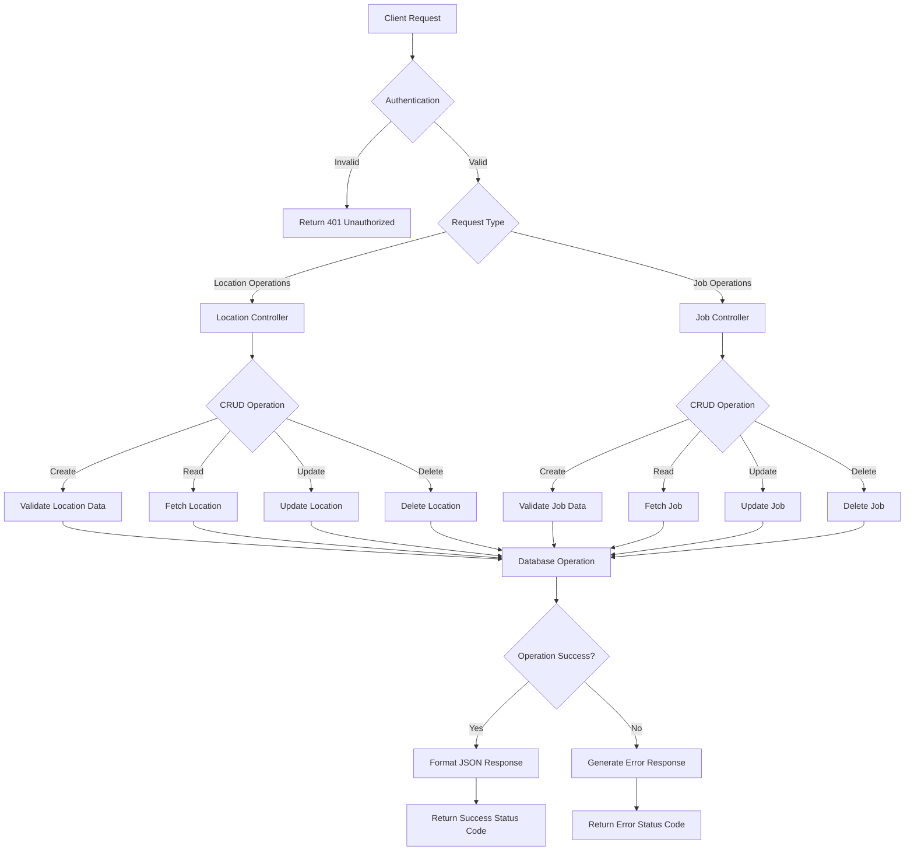
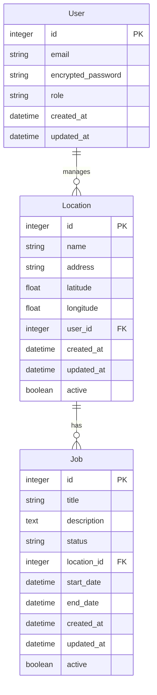
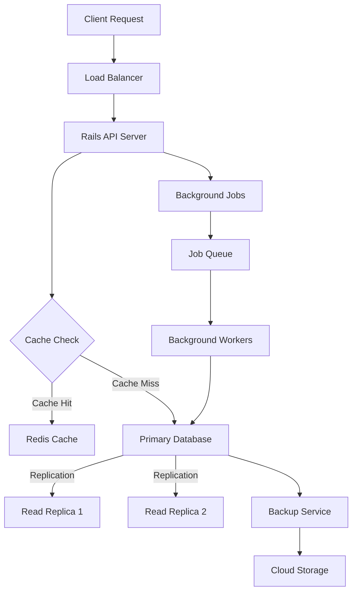

# Product Requirements Document (PRD)

# 1. INTRODUCTION

## 1.1 Purpose
This Software Requirements Specification (SRS) document provides a detailed description of the requirements for the REST API service built with Ruby on Rails. It serves as a comprehensive guide for developers, project managers, and stakeholders involved in the development and implementation of the API. This document will be used throughout the software development lifecycle to ensure all requirements are met and maintained.

## 1.2 Scope
The REST API service is designed to provide customers with the ability to manage locations and jobs through standardized HTTP endpoints. The system will:

- Enable customers to create and manage location records
- Allow customers to create and track jobs
- Provide a secure, scalable Ruby on Rails backend infrastructure
- Implement RESTful principles for all API endpoints
- Handle authentication and authorization for API access
- Support standard CRUD operations for core resources
- Return responses in JSON format
- Follow REST API best practices for status codes and error handling

The API will serve as a foundation for various client applications to interact with the system's core functionality while maintaining data consistency and security.

# 2. PRODUCT DESCRIPTION

## 2.1 Product Perspective
The REST API service is a standalone system that integrates into customers' existing technology stacks as a backend service. It operates as an independent Ruby on Rails application that:

- Functions as a stateless API service
- Provides HTTP endpoints accessible over the internet
- Interfaces with a dedicated database for data persistence
- Operates within modern cloud infrastructure
- Integrates with standard authentication systems

## 2.2 Product Functions
The core functions of the API include:

- Location Management
  - Create new location records
  - Retrieve location details
  - Update location information
  - Delete location records
  - List locations with filtering and pagination

- Job Management
  - Create new jobs
  - Track job status and progress
  - Update job details
  - Delete jobs
  - List jobs with filtering and pagination

- Authentication & Authorization
  - Secure API access
  - User authentication
  - Role-based access control
  - API key management

## 2.3 User Characteristics
The API is designed for the following user types:

1. Technical Integration Engineers
   - Experienced in API integration
   - Familiar with REST principles
   - Understanding of HTTP protocols
   - Knowledge of JSON data formats

2. Customer Developers
   - Various programming language backgrounds
   - Experience with API consumption
   - Basic understanding of authentication flows

3. System Administrators
   - Managing API access and permissions
   - Monitoring system usage
   - Handling configuration changes

## 2.4 Constraints
1. Technical Constraints
   - Ruby on Rails framework limitations
   - Database scalability boundaries
   - API rate limiting requirements
   - Response time requirements (< 500ms)

2. Security Constraints
   - HTTPS encryption required
   - Authentication mandatory for all endpoints
   - Compliance with data protection regulations
   - Regular security audits required

3. Operational Constraints
   - 99.9% uptime requirement
   - Backup and recovery procedures
   - Maintenance windows coordination
   - Resource usage limitations

## 2.5 Assumptions and Dependencies
Assumptions:
- Customers have basic REST API integration knowledge
- Internet connectivity is available and stable
- Users can manage API credentials securely
- Client applications can process JSON responses

Dependencies:
- Ruby on Rails framework and its ecosystem
- Database management system availability
- Authentication service reliability
- Network infrastructure stability
- Third-party service integrations (if applicable)
- Development and deployment tools
- Testing frameworks and environments

# 3. PROCESS FLOWCHART

# 4. FUNCTIONAL REQUIREMENTS

## 4.1 Authentication and Authorization

### ID: F-001
### Description
Secure access control system for API endpoints using token-based authentication
### Priority
High
### Requirements

| ID | Requirement | Acceptance Criteria |
|----|-------------|-------------------|
| F-001-1 | API shall support token-based authentication | - Tokens must be JWT format - Tokens must expire after 24 hours - System must validate tokens on each request |
| F-001-2 | System shall provide token management endpoints | - Endpoint for token generation - Endpoint for token refresh - Endpoint for token revocation |
| F-001-3 | System shall implement role-based access control | - Support for admin and user roles - Role-specific endpoint access - Role validation on each request |

## 4.2 Location Management

### ID: F-002
### Description
CRUD operations for managing location records
### Priority
High
### Requirements

| ID | Requirement | Acceptance Criteria |
|----|-------------|-------------------|
| F-002-1 | System shall support location creation | - Validate required fields - Generate unique location ID - Store in database |
| F-002-2 | System shall support location retrieval | - Get by ID - List with pagination - Filter by attributes |
| F-002-3 | System shall support location updates | - Partial updates allowed - Full updates allowed - Validation of updated fields |
| F-002-4 | System shall support location deletion | - Soft delete implementation - Cascade deletion of related records - Validation of deletion permissions |

## 4.3 Job Management

### ID: F-003
### Description
CRUD operations for managing job records
### Priority
High
### Requirements

| ID | Requirement | Acceptance Criteria |
|----|-------------|-------------------|
| F-003-1 | System shall support job creation | - Validate required fields - Generate unique job ID - Link to location - Store in database |
| F-003-2 | System shall support job retrieval | - Get by ID - List with pagination - Filter by status and location |
| F-003-3 | System shall support job updates | - Status updates - Progress tracking - Field validation |
| F-003-4 | System shall support job deletion | - Soft delete implementation - Validation of deletion permissions |

## 4.4 API Response Handling

### ID: F-004
### Description
Standardized response formatting and error handling
### Priority
Medium
### Requirements

| ID | Requirement | Acceptance Criteria |
|----|-------------|-------------------|
| F-004-1 | System shall provide standardized JSON responses | - Consistent response structure - Proper content-type headers - UTF-8 encoding |
| F-004-2 | System shall implement proper HTTP status codes | - 2xx for success - 4xx for client errors - 5xx for server errors |
| F-004-3 | System shall provide detailed error messages | - Error code - Error description - Validation details when applicable |

## 4.5 Data Validation

### ID: F-005
### Description
Input validation and data integrity checks
### Priority
High
### Requirements

| ID | Requirement | Acceptance Criteria |
|----|-------------|-------------------|
| F-005-1 | System shall validate all input data | - Type checking - Format validation - Required field validation |
| F-005-2 | System shall sanitize input data | - XSS prevention - SQL injection prevention - Input trimming |
| F-005-3 | System shall maintain referential integrity | - Foreign key validation - Cascade operations - Orphan prevention |

# 5. NON-FUNCTIONAL REQUIREMENTS

## 5.1 Performance

| Requirement | Description | Target Metric |
|-------------|-------------|---------------|
| Response Time | Maximum time for API endpoint response | < 500ms for 95% of requests |
| Throughput | Number of concurrent API requests | 1000 requests/second |
| Database Performance | Maximum query execution time | < 100ms for 95% of queries |
| Memory Usage | Maximum memory usage per Rails instance | < 512MB |
| CPU Usage | Maximum CPU utilization | < 80% under normal load |
| API Rate Limiting | Maximum requests per client | 1000 requests/hour |

## 5.2 Safety

| Requirement | Description | Implementation |
|-------------|-------------|----------------|
| Data Backup | Regular backup of all system data | Daily incremental, weekly full backups |
| Failure Recovery | System recovery procedures | Maximum 1-hour recovery time |
| Data Integrity | Prevention of data corruption | Transaction management, data validation |
| Error Handling | Graceful handling of system failures | Proper error logging and notification |
| Rollback Capability | Ability to revert system changes | Database transaction rollbacks |

## 5.3 Security

| Requirement | Description | Implementation |
|-------------|-------------|----------------|
| Authentication | Secure user authentication | JWT tokens with 24-hour expiration |
| Authorization | Role-based access control | User roles and permissions system |
| Data Encryption | Protection of sensitive data | TLS 1.3 for transport, AES-256 for storage |
| API Security | Protection against common attacks | Rate limiting, input validation |
| Audit Logging | Track system access and changes | Detailed audit trails with timestamps |
| Password Security | Secure password handling | Bcrypt hashing with salt |

## 5.4 Quality

### 5.4.1 Availability
- System uptime: 99.9% (excluding planned maintenance)
- Maximum planned downtime: 4 hours/month
- Unplanned downtime resolution: < 2 hours

### 5.4.2 Maintainability
- Code documentation coverage: > 90%
- Test coverage: > 85%
- Modular architecture with clear separation of concerns
- Automated deployment processes

### 5.4.3 Usability
- RESTful API conventions compliance
- Consistent JSON response format
- Comprehensive API documentation
- Meaningful error messages

### 5.4.4 Scalability
- Horizontal scaling capability
- Auto-scaling based on load
- Database partitioning support
- Caching implementation

### 5.4.5 Reliability
- Mean Time Between Failures (MTBF): > 720 hours
- Mean Time To Recovery (MTTR): < 2 hours
- Error rate: < 0.1% of all requests
- Data consistency guarantee

## 5.5 Compliance

| Requirement | Description | Standard/Regulation |
|-------------|-------------|-------------------|
| Data Protection | Personal data handling compliance | GDPR, CCPA |
| API Standards | RESTful API design compliance | OpenAPI 3.0 |
| Security Standards | Security implementation compliance | OWASP Top 10 |
| Industry Standards | Web service implementation | RFC 7231 HTTP/1.1 |
| Code Quality | Code quality standards | Ruby Style Guide |
| Documentation | API documentation standards | OpenAPI Specification |

# 6. DATA REQUIREMENTS

## 6.1 Data Models

## 6.2 Data Storage

### 6.2.1 Database Configuration
- Primary Database: PostgreSQL 14+
- Connection Pooling: PgBouncer
- Read Replicas: Minimum 2 for high availability
- Sharding Strategy: Location-based horizontal sharding

### 6.2.2 Data Retention
- Active Records: Indefinite retention in primary database
- Soft-deleted Records: 90 days retention
- Audit Logs: 1 year retention
- System Logs: 30 days retention

### 6.2.3 Backup Strategy
- Full Database Backup: Weekly
- Incremental Backups: Daily
- Point-in-time Recovery: 30 days retention
- Backup Storage: Encrypted cloud storage with geographic redundancy

### 6.2.4 Recovery Procedures
- Recovery Time Objective (RTO): 1 hour
- Recovery Point Objective (RPO): 5 minutes
- Automated failover to read replicas
- Cross-region disaster recovery capability

## 6.3 Data Processing

### 6.3.1 Data Security
- Encryption at Rest: AES-256
- Encryption in Transit: TLS 1.3
- Data Masking: PII fields masked in logs
- Access Control: Row-level security enabled

### 6.3.2 Data Flow

### 6.3.3 Data Validation Rules
- Location:
  - Name: Required, max 255 characters
  - Address: Required, max 1000 characters
  - Coordinates: Optional, validated format
  - Active status: Required boolean

- Job:
  - Title: Required, max 255 characters
  - Description: Optional, max 5000 characters
  - Status: Required, enum of predefined values
  - Dates: Required, valid datetime format
  - Location association: Required, must exist

### 6.3.4 Data Caching
- Cache Strategy: Write-through
- Cache Technology: Redis
- Cache Duration: 1 hour default
- Cache Invalidation: Event-based
- Cached Items:
  - Frequently accessed locations
  - Active job listings
  - User authentication tokens
  - API response data

# 7. EXTERNAL INTERFACES

## 7.1 Software Interfaces

### 7.1.1 Database Interface
- PostgreSQL 14+ via ActiveRecord ORM
- Connection parameters managed through Rails database.yml
- Minimum required version: PostgreSQL 14.0
- Interface Protocol: PostgreSQL wire protocol
- Connection pooling via PgBouncer

### 7.1.2 Cache Interface
- Redis 6+ for caching layer
- Connection via redis-rb gem
- Interface Protocol: Redis Serialization Protocol (RESP)
- Required version: Redis 6.0 or higher

### 7.1.3 External Service Interfaces
- Authentication Service
  - JWT token validation
  - Protocol: HTTPS/REST
  - Data Format: JSON
  - Required Headers: Authorization Bearer token

- Monitoring Services
  - New Relic APM integration
  - Protocol: HTTPS
  - Data Format: Proprietary New Relic format
  - Metrics reporting interval: 60 seconds

## 7.2 Communication Interfaces

### 7.2.1 Network Protocols
- Primary Protocol: HTTPS (TLS 1.3)
- API Protocol: REST over HTTPS
- WebSocket Support: Action Cable (optional for real-time updates)
- Port Requirements:
  - HTTPS: 443
  - PostgreSQL: 5432
  - Redis: 6379

### 7.2.2 Data Formats
- Request/Response Format: JSON
- Character Encoding: UTF-8
- Content-Type: application/json
- API Version Header: X-API-Version
- Date Format: ISO 8601

### 7.2.3 Communication Security
- TLS 1.3 required for all external communications
- Certificate requirements:
  - 2048-bit RSA key minimum
  - SHA-256 signature algorithm
  - Valid CA-signed certificate
- Perfect Forward Secrecy (PFS) enabled
- HTTP/2 protocol support

## 7.3 API Interface Specifications

| Endpoint Category | Base URL | Version Header |
|------------------|----------|----------------|
| Location API | /api/locations | X-API-Version: 1.0 |
| Job API | /api/jobs | X-API-Version: 1.0 |
| Authentication | /api/auth | X-API-Version: 1.0 |

### 7.3.1 Request Headers

| Header Name | Required | Description |
|-------------|----------|-------------|
| Authorization | Yes | Bearer {token} |
| Content-Type | Yes | application/json |
| Accept | Yes | application/json |
| X-API-Version | Yes | API version number |
| X-Request-ID | No | Unique request identifier |

### 7.3.2 Response Headers

| Header Name | Description |
|-------------|-------------|
| Content-Type | application/json |
| X-Request-ID | Echo of request ID |
| X-RateLimit-Limit | Rate limit ceiling |
| X-RateLimit-Remaining | Remaining requests |
| X-RateLimit-Reset | Rate limit reset time |

# 8. APPENDICES

## 8.1 GLOSSARY

| Term | Definition |
|------|------------|
| ActiveRecord | Object-relational mapping (ORM) library used in Rails to interact with databases |
| CRUD | Create, Read, Update, Delete - the four basic operations of persistent storage |
| Endpoint | A specific URL where an API service can be accessed |
| JWT | JSON Web Token - a compact, URL-safe means of representing claims between parties |
| Migration | A Ruby class for making changes to the database schema |
| REST | Representational State Transfer - architectural style for distributed systems |
| Soft Delete | A way to mark records as deleted without physically removing them from the database |
| Token | A piece of data used for authenticating a user or session |

## 8.2 ACRONYMS

| Acronym | Definition |
|---------|------------|
| API | Application Programming Interface |
| CCPA | California Consumer Privacy Act |
| GDPR | General Data Protection Regulation |
| HTTP | Hypertext Transfer Protocol |
| HTTPS | Hypertext Transfer Protocol Secure |
| JSON | JavaScript Object Notation |
| JWT | JSON Web Token |
| MTBF | Mean Time Between Failures |
| MTTR | Mean Time To Recovery |
| ORM | Object-Relational Mapping |
| PII | Personally Identifiable Information |
| REST | Representational State Transfer |
| RFC | Request for Comments |
| RTO | Recovery Time Objective |
| RPO | Recovery Point Objective |
| SRS | Software Requirements Specification |
| TLS | Transport Layer Security |
| UTF-8 | Unicode Transformation Format - 8-bit |
| XSS | Cross-Site Scripting |

## 8.3 ADDITIONAL REFERENCES

| Reference | Description | URL |
|-----------|-------------|-----|
| Ruby on Rails Guides | Official documentation for Ruby on Rails framework | https://guides.rubyonrails.org |
| PostgreSQL Documentation | Official documentation for PostgreSQL database | https://www.postgresql.org/docs |
| JWT.io | Information and tools for JSON Web Tokens | https://jwt.io |
| OpenAPI Specification | REST API documentation standard | https://swagger.io/specification |
| Ruby Style Guide | Community-driven Ruby coding style guide | https://rubystyle.guide |
| OWASP API Security | API security best practices and top 10 risks | https://owasp.org/www-project-api-security |