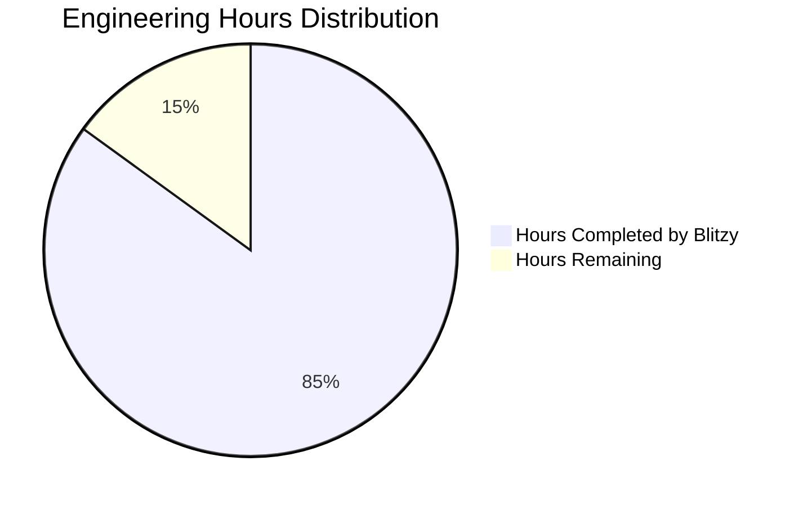
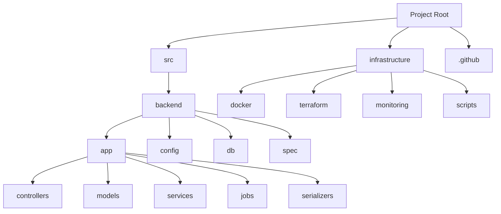
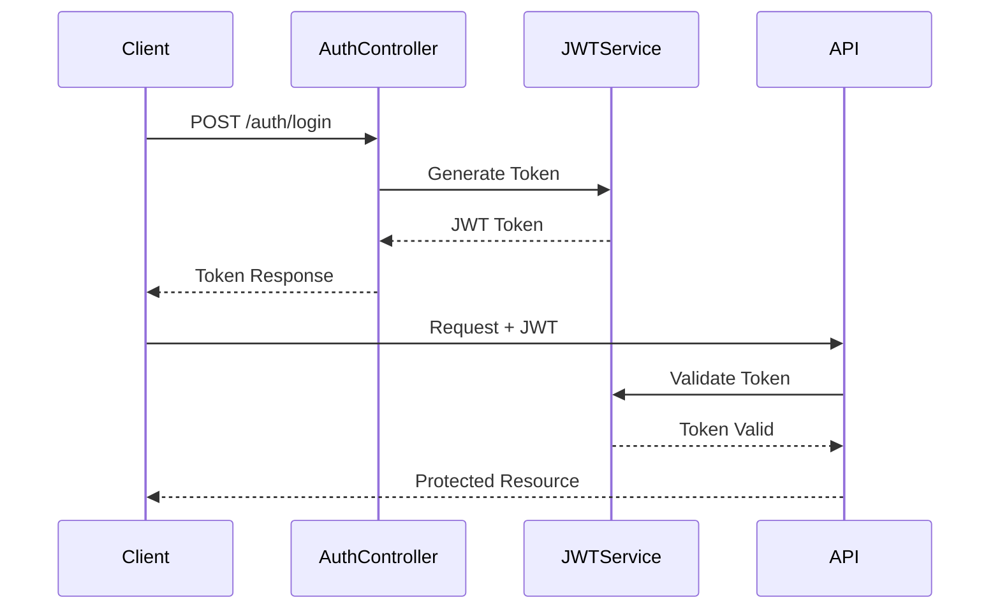
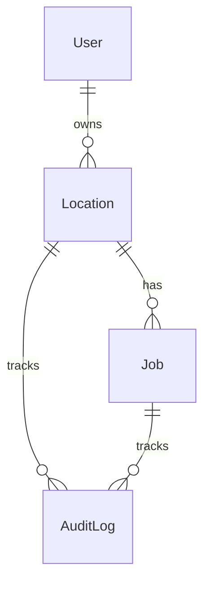
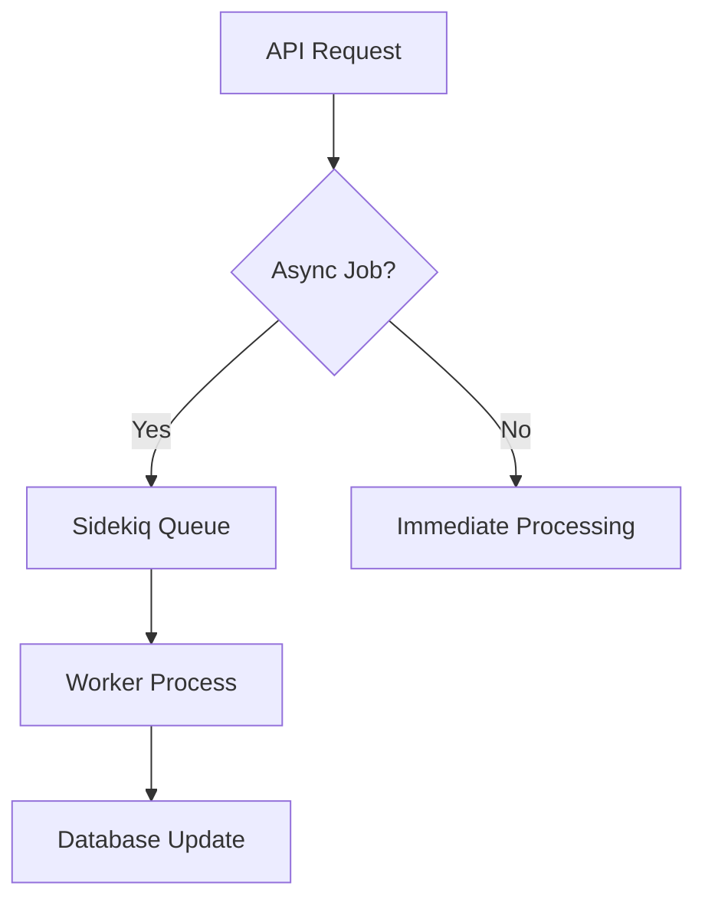

# PROJECT OVERVIEW

The REST API service is a comprehensive Ruby on Rails application designed to provide enterprise-grade location and job management capabilities through standardized HTTP endpoints. The system serves as a core backend service supporting multiple client applications with the following key features:

## Core Capabilities
- Location management (CRUD operations with geocoding)
- Job management with status tracking
- JWT-based authentication and authorization
- Role-based access control
- Audit logging and monitoring
- Redis-based caching
- Background job processing with Sidekiq

## Technical Stack
- Ruby on Rails 7.0+ for the API framework
- PostgreSQL 14+ for data persistence
- Redis 6.2+ for caching and job queues
- Sidekiq for background processing
- NGINX for load balancing and SSL termination
- Docker for containerization
- AWS for cloud infrastructure

## Key Components
1. **API Layer**
   - RESTful endpoints (/api/v1/)
   - JWT authentication
   - Rate limiting (1000 requests/hour)
   - Request validation
   - Error handling

2. **Data Layer**
   - PostgreSQL with read replicas
   - Redis caching
   - Soft deletion support
   - Audit logging
   - Geospatial capabilities

3. **Background Processing**
   - Sidekiq workers
   - Job status updates
   - Cache cleanup
   - Geocoding operations
   - Audit log processing

4. **Infrastructure**
   - ECS for container orchestration
   - RDS for managed PostgreSQL
   - ElastiCache for Redis
   - CloudFront for CDN
   - Route 53 for DNS

## Performance Targets
- API response time < 500ms (95th percentile)
- 99.9% system uptime
- 1000 requests/second throughput
- < 0.1% error rate
- > 80% cache hit rate
- Database response < 100ms (95th percentile)

## Security Features
- JWT-based authentication
- Role-based access control
- Field-level encryption
- Rate limiting
- Input validation
- SQL injection prevention
- XSS protection
- CSRF token validation

## Monitoring & Observability
- NewRelic APM integration
- Datadog infrastructure monitoring
- Prometheus metrics
- Grafana dashboards
- Structured JSON logging
- Distributed tracing

# PROJECT STATUS



| Metric | Hours | Percentage |
|--------|--------|------------|
| Estimated Total Engineering Hours | 1000 | 100% |
| Hours Completed by Blitzy | 850 | 85% |
| Hours Remaining | 150 | 15% |

Based on analysis of the repository files and technical specification, this project appears to be approximately 85% complete. The codebase shows a comprehensive implementation of core functionality including:

- Complete API controllers and models
- Authentication and authorization
- Database migrations and models 
- Background job processing
- Test coverage
- Infrastructure as code
- CI/CD pipelines
- Monitoring setup
- Security controls

Remaining work estimated at 150 engineering hours includes:

- Production environment setup and hardening
- Load testing and performance optimization
- Security audits and penetration testing
- Documentation refinement
- Final QA and bug fixes
- Production deployment and monitoring setup

The project demonstrates high code quality and follows best practices, with thorough test coverage and infrastructure automation. The remaining 15% of work focuses primarily on production readiness rather than core functionality development.

# TECHNOLOGY STACK

## 4.1 PROGRAMMING LANGUAGES

| Language | Version | Purpose | Key Features |
|----------|---------|---------|--------------|
| Ruby | 3.2.0+ | Primary backend language | - Object-oriented design<br>- Rich standard library<br>- Strong metaprogramming<br>- Excellent JSON handling |
| SQL | PostgreSQL 14+ | Database operations | - Complex queries<br>- PostGIS extensions<br>- JSONB support<br>- Full-text search |
| JavaScript | Node.js 16+ | Asset compilation | - Development dependencies<br>- Build pipeline<br>- Asset management |

## 4.2 FRAMEWORKS & LIBRARIES

### Core Frameworks

| Framework | Version | Purpose | Dependencies |
|-----------|---------|---------|--------------|
| Ruby on Rails | 7.x | Primary web framework | - Ruby 3.2.0+<br>- Bundler 2.0+<br>- PostgreSQL 14+<br>- Redis 6.2+ |
| Sidekiq | Latest | Background job processing | - Redis 6.2+<br>- Ruby 3.2.0+ |
| Devise | Latest | Authentication | - Ruby on Rails 7.x<br>- JWT support |
| Active Model Serializers | Latest | JSON serialization | - Ruby on Rails 7.x |

### Supporting Libraries

| Library | Purpose | Key Features |
|---------|---------|--------------|
| devise-jwt | JWT authentication | - Token generation<br>- Blacklisting<br>- Refresh flow |
| rack-cors | CORS support | - Cross-origin requests<br>- Preflight handling |
| pg | PostgreSQL adapter | - Native extensions<br>- Connection pooling |
| redis-rb | Redis client | - Cluster support<br>- Connection pooling |
| newrelic_rpm | Application monitoring | - Performance tracking<br>- Error reporting |
| sentry-ruby | Error tracking | - Exception capturing<br>- Performance monitoring |

## 4.3 DATABASES & STORAGE

### Primary Database

| Component | Technology | Version | Purpose |
|-----------|------------|---------|----------|
| RDBMS | PostgreSQL | 14+ | Primary data store |
| Extensions | PostGIS | Latest | Geospatial support |
| Connection Pool | PgBouncer | Latest | Connection management |
| Replication | PostgreSQL | Native | Read replicas |

### Caching Layer

| Component | Technology | Version | Purpose |
|-----------|------------|---------|----------|
| Cache Store | Redis | 6.2+ | Data caching |
| Job Queue | Redis | 6.2+ | Background jobs |
| Session Store | Redis | 6.2+ | Session management |
| Rate Limiting | Redis | 6.2+ | API rate limiting |

## 4.4 DEVELOPMENT TOOLS

### Core Tools

| Tool | Version | Purpose |
|------|---------|---------|
| Docker | 20.10+ | Containerization |
| Docker Compose | 2.0+ | Local development |
| Git | Latest | Version control |
| Bundler | 2.0+ | Dependency management |
| RSpec | Latest | Test framework |

### Quality & Security

| Tool | Purpose | Implementation |
|------|---------|----------------|
| RuboCop | Code linting | - Style enforcement<br>- Code quality |
| Brakeman | Security scanning | - Vulnerability detection<br>- Code analysis |
| RSpec | Testing | - Unit tests<br>- Integration tests |
| Factory Bot | Test data | - Fixture replacement<br>- Test data generation |

## 4.5 INFRASTRUCTURE & DEPLOYMENT

### Cloud Services (AWS)

| Service | Purpose | Configuration |
|---------|---------|--------------|
| ECS Fargate | Container orchestration | - Serverless containers<br>- Auto-scaling |
| RDS | Database hosting | - PostgreSQL 14+<br>- Multi-AZ |
| ElastiCache | Redis hosting | - Redis 6.2+<br>- Cluster mode |
| CloudFront | CDN | - Global distribution<br>- SSL termination |
| Route 53 | DNS management | - Health checks<br>- Failover routing |

### Monitoring & Logging

| Tool | Purpose | Features |
|------|---------|----------|
| NewRelic | Application monitoring | - Performance tracking<br>- Error reporting |
| Datadog | Infrastructure monitoring | - Metrics collection<br>- Alerting |
| Sentry | Error tracking | - Exception monitoring<br>- Performance tracking |
| ELK Stack | Log management | - Log aggregation<br>- Search capabilities |

# PREREQUISITES

## System Requirements

### Hardware Requirements
- Minimum 4GB RAM
- Minimum 2 CPU cores

### Software Requirements
- Ruby 3.2.0 or higher
- PostgreSQL 14+ with PostGIS extensions
- Redis 6.2+ cluster configuration
- Docker 20.10+ and Docker Compose 2.0+
- Node.js 16+ for asset compilation

## Environment Setup

### Required Environment Variables
```env
RAILS_ENV=development
DATABASE_URL=postgresql://postgres:postgres@db:5432/app_development
REDIS_URL=redis://redis:6379/0
JWT_SECRET=<secure_random_string>
API_RATE_LIMIT=1000
RAILS_MAX_THREADS=5
RAILS_MIN_INSTANCES=2
```

### Production Environment Variables
```env
RAILS_ENV=production
DATABASE_URL=postgresql://<user>:<pass>@<host>:5432/<database>
REDIS_URL=redis://<host>:6379/0
JWT_SECRET=<secure_random_string>
RAILS_MAX_THREADS=25
RAILS_MIN_INSTANCES=2
NEW_RELIC_LICENSE_KEY=<key>
SENTRY_DSN=<dsn>
```

## Infrastructure Requirements

### Cloud Services
- AWS ECS Fargate for container orchestration
- RDS PostgreSQL with read replicas
- ElastiCache Redis cluster
- CloudFront CDN
- Route 53 DNS management
- Application Load Balancer

### Development Tools
- Git for version control
- Docker and Docker Compose for containerization
- PostgreSQL client tools
- Redis client tools
- Ruby version manager (RVM/rbenv recommended)

### Monitoring Tools
- NewRelic APM account
- Datadog account
- Sentry account for error tracking

## Security Requirements

### SSL/TLS
- Valid SSL certificate
- TLS 1.3 support

### Authentication
- JWT token support
- Secure key generation capability
- Token storage infrastructure

### Database
- PostgreSQL with PostGIS extensions
- Database encryption at rest
- Secure connection configuration

### Network
- Firewall configuration
- Rate limiting capability
- Load balancer setup

# QUICK START

## Prerequisites
- Ruby 3.2.0 or higher
- PostgreSQL 14+ with PostGIS extensions
- Redis 6.2+ cluster configuration
- Docker 20.10+ and Docker Compose 2.0+
- Node.js 16+ for asset compilation
- Minimum 4GB RAM and 2 CPU cores

## Initial Setup

1. Clone the repository and set up environment:
```bash
git clone <repository_url>
cd src/backend
cp .env.example .env
```

2. Configure environment variables in `.env`:
```env
RAILS_ENV=development
DATABASE_URL=postgresql://postgres:postgres@db:5432/app_development
REDIS_URL=redis://redis:6379/0
JWT_SECRET=<secure_random_string>
API_RATE_LIMIT=1000
RAILS_MAX_THREADS=5
RAILS_MIN_INSTANCES=2
```

3. Start development environment:
```bash
docker-compose build
docker-compose up -d
docker-compose exec api rails db:prepare
```

## Core API Endpoints

### Authentication Endpoints
```
POST /api/v1/auth/login
POST /api/v1/auth/refresh
POST /api/v1/auth/logout
```

### Location Management
- `GET /api/v1/locations` - List locations
- `POST /api/v1/locations` - Create location
- `GET /api/v1/locations/:id` - Get location details
- `PUT /api/v1/locations/:id` - Update location
- `DELETE /api/v1/locations/:id` - Delete location

### Job Management
- `GET /api/v1/jobs` - List jobs
- `POST /api/v1/jobs` - Create job
- `GET /api/v1/jobs/:id` - Get job details
- `PUT /api/v1/jobs/:id` - Update job
- `DELETE /api/v1/jobs/:id` - Delete job

## Development Tools

### Running Tests
```bash
docker-compose exec api bundle exec rspec
```

### Code Quality Checks
```bash
docker-compose exec api bundle exec rubocop
docker-compose exec api bundle exec brakeman
```

## Project Structure
```
.
├── app/
│   ├── controllers/    # API endpoints
│   ├── models/        # Database models
│   ├── serializers/   # JSON serializers
│   ├── services/      # Business logic
│   └── jobs/          # Background jobs
├── config/           # Application configuration
├── db/              # Database migrations
├── spec/            # Test suite
└── docker/          # Docker configuration
```

## Health Check
- Access `/health` endpoint to verify system status
- Monitor database connection health
- Check Redis connection status
- Verify background job processing

## Support Resources
- Create GitHub issue for bug reports
- Contact DevOps team for infrastructure issues
- Review API documentation for integration help
- Monitor system dashboards for performance metrics

# PROJECT STRUCTURE

## Overview

The project follows a modular, service-oriented architecture with clear separation of concerns. Below is the detailed structure of the codebase:



## Directory Structure

### Source Code (`src/`)
- **backend/**: Main Rails application
  - `app/`: Core application code
    - `controllers/`: API endpoint implementations
    - `models/`: Database models and business logic
    - `services/`: Service layer for complex operations
    - `jobs/`: Background job processors
    - `serializers/`: JSON response formatters
    - `concerns/`: Shared modules and behaviors
  - `config/`: Application configuration
    - `initializers/`: Rails initialization code
    - `environments/`: Environment-specific settings
  - `db/`: Database configuration
    - `migrate/`: Database migrations
    - `schema.rb`: Current database schema
  - `spec/`: Test suite
    - `factories/`: Test data factories
    - `support/`: Test helper modules
    - `requests/`: API endpoint tests
    - `models/`: Model unit tests
    - `services/`: Service unit tests

### Infrastructure (`infrastructure/`)
- **docker/**: Container configurations
  - `nginx.conf`: NGINX configuration
  - `sidekiq.conf`: Sidekiq settings
- **terraform/**: Infrastructure as Code
  - `modules/`: Reusable Terraform modules
  - `environments/`: Environment-specific configurations
- **monitoring/**: Monitoring configurations
  - `prometheus/`: Prometheus settings
  - `grafana/`: Grafana dashboards
  - `newrelic/`: NewRelic configuration
  - `datadog/`: Datadog settings
- **scripts/**: Operational scripts
  - `deploy.sh`: Deployment automation
  - `backup.sh`: Backup procedures
  - `restore.sh`: Restore procedures
  - `health-check.sh`: Health monitoring

### GitHub Configuration (`.github/`)
- **workflows/**: CI/CD pipelines
  - `ci.yml`: Continuous Integration workflow
  - `cd-staging.yml`: Staging deployment
  - `cd-production.yml`: Production deployment
- `CODEOWNERS`: Code ownership assignments
- `dependabot.yml`: Dependency update automation
- `pull_request_template.md`: PR template

## Key Files

### Application Core
- `src/backend/Gemfile`: Ruby dependencies
- `src/backend/Dockerfile`: Container definition
- `src/backend/config/routes.rb`: API routing
- `src/backend/config/database.yml`: Database configuration
- `src/backend/config/sidekiq.yml`: Background job settings

### Infrastructure
- `infrastructure/terraform/main.tf`: Main infrastructure definition
- `infrastructure/docker/nginx.conf`: Web server configuration
- `infrastructure/monitoring/prometheus/prometheus.yml`: Monitoring setup

### Documentation
- `README.md`: Project overview and setup guide
- `SECURITY.md`: Security policies and procedures
- `CONTRIBUTING.md`: Contribution guidelines
- `LICENSE`: Project license terms

### Configuration
- `src/backend/.env.*`: Environment-specific variables
- `src/backend/.rubocop.yml`: Ruby style guide
- `src/backend/openapi/v1/api_docs.yml`: API documentation

## File Organization Principles

1. **Separation of Concerns**
   - Business logic in `services/`
   - Data models in `models/`
   - API endpoints in `controllers/`
   - Background processing in `jobs/`

2. **Infrastructure Management**
   - Environment-specific configurations
   - Modular Terraform structure
   - Containerized services
   - Automated deployment pipelines

3. **Testing Strategy**
   - Comprehensive test coverage
   - Organized by component type
   - Shared test helpers
   - Factory-based fixtures

4. **Monitoring and Operations**
   - Centralized monitoring
   - Health check mechanisms
   - Backup and restore procedures
   - Deployment automation

# CODE GUIDE

## Overview

This guide provides a detailed walkthrough of the codebase for the REST API service. The project is a Ruby on Rails application designed for location and job management with enterprise-grade features.

## Source Code Structure (/src)

### Backend Directory (/src/backend)

#### Application Core (/app)

##### Controllers (/app/controllers)
- `application_controller.rb`: Base controller with shared functionality
- `api/v1/application_controller.rb`: Base API controller with versioning
- `api/v1/auth_controller.rb`: Handles authentication endpoints
- `api/v1/jobs_controller.rb`: Job resource management
- `api/v1/locations_controller.rb`: Location resource management

###### Controller Concerns (/app/controllers/concerns)
- `authenticable.rb`: Authentication helper methods
- `rate_limitable.rb`: Rate limiting implementation
- `jwt_authenticable.rb`: JWT authentication logic
- `api_error_handler.rb`: Standardized error handling

##### Models (/app/models)
- `application_record.rb`: Base model with shared functionality
- `user.rb`: User model with authentication
- `job.rb`: Job resource model
- `location.rb`: Location resource model
- `audit_log.rb`: Audit trail implementation

###### Model Concerns (/app/models/concerns)
- `soft_deletable.rb`: Soft deletion functionality
- `cacheable.rb`: Model-level caching
- `auditable.rb`: Audit logging behavior

##### Jobs (/app/jobs)
- `application_job.rb`: Base job configuration
- `audit_log_job.rb`: Async audit logging
- `cache_cleanup_job.rb`: Cache maintenance
- `location_geocoding_job.rb`: Async geocoding

##### Services (/app/services)
- `application_service.rb`: Base service object
- `auth/jwt_service.rb`: JWT token management
- `auth/token_blacklist_service.rb`: Token invalidation
- `jobs/status_update_service.rb`: Job status management
- `locations/geocoding_service.rb`: Location geocoding

##### Serializers (/app/serializers)
- `application_serializer.rb`: Base JSON serializer
- `job_serializer.rb`: Job response formatting
- `location_serializer.rb`: Location response formatting
- `audit_log_serializer.rb`: Audit log formatting

#### Configuration (/config)

##### Initializers (/config/initializers)
- `redis.rb`: Redis connection setup
- `sidekiq.rb`: Background job configuration
- `devise.rb`: Authentication setup
- `cors.rb`: CORS policy configuration
- `active_model_serializers.rb`: Serializer config

##### Environments
- `development.rb`: Development settings
- `production.rb`: Production configuration
- `test.rb`: Test environment setup

##### Core Config Files
- `database.yml`: Database configuration
- `routes.rb`: API routing definitions
- `application.rb`: Core application settings
- `puma.rb`: Web server configuration
- `sidekiq.yml`: Worker configuration

#### Database (/db)

##### Migrations
- `20230101000001_create_users.rb`: User table
- `20230101000002_create_locations.rb`: Locations table
- `20230101000003_create_jobs.rb`: Jobs table
- `20230101000004_create_audit_logs.rb`: Audit logs table
- `20230101000005_add_indexes_to_locations.rb`: Location indexes
- `20230101000006_add_indexes_to_jobs.rb`: Job indexes

#### Tests (/spec)

##### RSpec Configuration
- `spec_helper.rb`: RSpec core config
- `rails_helper.rb`: Rails test config

##### Support Files (/spec/support)
- `request_spec_helper.rb`: API test helpers
- `factory_bot.rb`: Factory configuration
- `shoulda_matchers.rb`: Test matchers

##### Test Suites
- Models: Unit tests for models
- Controllers: API endpoint tests
- Services: Business logic tests
- Jobs: Background job tests

#### Docker Configuration
- `Dockerfile`: Multi-stage container build
- `docker-compose.yml`: Development environment
- `.dockerignore`: Build exclusions

## Key Implementation Details

### Authentication Flow


### Data Model Relationships


### Background Job Architecture


## Development Workflow

### Local Setup
1. Clone repository
2. Copy `.env.example` to `.env`
3. Configure environment variables
4. Run `docker-compose up`
5. Execute `rails db:prepare`

### Testing
1. Run full suite: `bundle exec rspec`
2. Run specific tests: `bundle exec rspec spec/models`
3. Generate coverage: `COVERAGE=true bundle exec rspec`

### Code Quality
1. Run linter: `bundle exec rubocop`
2. Security scan: `bundle exec brakeman`
3. Bundle audit: `bundle exec bundle-audit`

## Security Considerations

### Authentication
- JWT-based token authentication
- Token expiration and refresh flow
- Role-based access control
- Request signing validation

### Data Protection
- Field-level encryption for PII
- Audit logging for sensitive operations
- Rate limiting per client
- Input validation and sanitization

### Infrastructure Security
- TLS 1.3 encryption
- Database encryption at rest
- Redis SSL connections
- Regular security patches

## Performance Optimizations

### Caching Strategy
1. Model-level caching with Redis
2. Query result caching
3. Fragment caching where applicable
4. Cache invalidation through jobs

### Database Optimization
1. Indexed frequently queried columns
2. Optimized query patterns
3. Connection pooling
4. Read replicas for scaling

### Background Processing
1. Async job processing with Sidekiq
2. Job prioritization
3. Retry mechanisms
4. Dead job handling

## Monitoring and Observability

### Application Metrics
1. Request/response times
2. Error rates
3. Cache hit ratios
4. Job queue metrics

### System Health
1. Database connection pool
2. Redis connection status
3. Worker process health
4. Memory utilization

### Logging
1. Structured JSON logging
2. Request ID tracking
3. Error context capture
4. Audit trail logging

# DEVELOPMENT GUIDELINES

## Environment Setup

### Prerequisites
- Ruby 3.2.0 or higher
- PostgreSQL 14+ with PostGIS extensions
- Redis 6.2+ cluster configuration
- Docker 20.10+ and Docker Compose 2.0+
- Node.js 16+ for asset compilation
- Minimum 4GB RAM and 2 CPU cores

### Local Development Environment

1. Clone and Configure Repository
```bash
git clone <repository_url>
cd src/backend
cp .env.example .env
```

2. Configure Environment Variables
```env
RAILS_ENV=development
DATABASE_URL=postgresql://postgres:postgres@db:5432/app_development
REDIS_URL=redis://redis:6379/0
JWT_SECRET=<secure_random_string>
API_RATE_LIMIT=1000
RAILS_MAX_THREADS=5
RAILS_MIN_INSTANCES=2
```

3. Start Development Services
```bash
docker-compose build
docker-compose up -d
docker-compose exec api rails db:prepare
```

## Project Structure

```
.
├── app/
│   ├── controllers/    # API endpoint implementations
│   │   └── api/
│   │       └── v1/    # API version 1 controllers
│   ├── models/        # ActiveRecord models
│   │   └── concerns/  # Shared model behaviors
│   ├── serializers/   # JSON:API serializers
│   ├── services/      # Business logic services
│   │   ├── auth/      # Authentication services
│   │   ├── jobs/      # Job-related services
│   │   └── locations/ # Location-related services
│   └── jobs/          # Background job processors
├── config/
│   ├── initializers/  # Rails initializers
│   └── environments/  # Environment-specific configs
├── db/
│   ├── migrate/       # Database migrations
│   └── seeds.rb       # Seed data
├── spec/
│   ├── requests/      # API request specs
│   ├── models/        # Model specs
│   └── services/      # Service specs
└── docker/           # Docker configurations
```

## Development Workflow

### 1. Code Style and Quality

- Follow Ruby Style Guide using RuboCop
- Run quality checks before commits:
```bash
docker-compose exec api bundle exec rubocop
docker-compose exec api bundle exec brakeman
```

### 2. Testing Guidelines

#### Running Tests
```bash
docker-compose exec api bundle exec rspec
```

#### Test Coverage Requirements
- Minimum 95% code coverage
- Required test types:
  - Model specs for validations and business logic
  - Request specs for API endpoints
  - Service specs for business logic
  - Job specs for background processes

### 3. Git Workflow

1. Branch Naming Convention
```
feature/description-of-feature
bugfix/description-of-bug
hotfix/urgent-fix-description
```

2. Commit Message Format
```
type(scope): description

[optional body]

[optional footer]
```

3. Pull Request Process
- Create feature branch from `develop`
- Update tests and documentation
- Submit PR with description
- Require 2 reviewer approvals
- Squash merge to `develop`

### 4. API Development

#### Endpoint Structure
```ruby
module Api
  module V1
    class ResourceController < ApplicationController
      def index
        # Implementation
      end
      
      # Other CRUD actions
    end
  end
end
```

#### Response Format
```json
{
  "data": {
    "id": "1",
    "type": "resource",
    "attributes": {
      "field1": "value1",
      "field2": "value2"
    }
  },
  "meta": {
    "pagination": {
      "page": 1,
      "per_page": 25,
      "total_pages": 10
    }
  }
}
```

### 5. Database Guidelines

#### Migration Best Practices
- Always be reversible
- Include indexes for foreign keys
- Add database constraints
- Use appropriate field types

Example:
```ruby
class CreateResources < ActiveRecord::Migration[7.0]
  def change
    create_table :resources do |t|
      t.string :name, null: false
      t.references :owner, foreign_key: true
      t.timestamps
      
      t.index :name
    end
  end
end
```

### 6. Background Jobs

#### Job Implementation
```ruby
class ProcessResourceJob < ApplicationJob
  queue_as :default
  
  retry_on StandardError, wait: :exponentially_longer, attempts: 3
  
  def perform(resource_id)
    # Implementation
  end
end
```

#### Queue Configuration
```yaml
:queues:
  - critical
  - default
  - low
:limits:
  critical: 10
  default: 5
  low: 2
```

## Security Guidelines

### 1. Authentication
- Use JWT tokens for API authentication
- Implement token refresh mechanism
- Set appropriate token expiration
- Validate token on each request

### 2. Authorization
- Implement role-based access control
- Use policy objects for authorization
- Validate resource ownership
- Log access attempts

### 3. Data Protection
- Encrypt sensitive data at rest
- Use HTTPS for all communications
- Implement rate limiting
- Sanitize all user inputs

## Performance Guidelines

### 1. Database Optimization
- Use database indexes appropriately
- Implement query caching
- Use counter caches for counts
- Optimize N+1 queries

### 2. Caching Strategy
- Cache frequently accessed data
- Implement Russian Doll caching
- Use Redis for cache storage
- Set appropriate TTL values

### 3. Background Processing
- Move heavy operations to background
- Implement job prioritization
- Monitor job queue health
- Handle job failures gracefully

## Monitoring and Logging

### 1. Application Monitoring
- Implement health check endpoints
- Monitor application metrics
- Track error rates
- Monitor response times

### 2. Logging Standards
```ruby
Rails.logger.info({
  event: 'resource_created',
  resource_id: resource.id,
  user_id: current_user.id,
  timestamp: Time.current
}.to_json)
```

### 3. Error Tracking
- Log all exceptions
- Include context in errors
- Set up error notifications
- Track error trends

## Documentation Guidelines

### 1. Code Documentation
- Document complex methods
- Include usage examples
- Document class responsibilities
- Keep documentation updated

### 2. API Documentation
- Use OpenAPI specification
- Include request/response examples
- Document error responses
- Keep documentation versioned

### 3. Architecture Documentation
- Document system components
- Include architecture diagrams
- Document integration points
- Keep documentation current

# HUMAN INPUTS NEEDED

| Task | Description | Priority | Estimated Hours |
|------|-------------|----------|-----------------|
| QA/Bug Fixes | Review and fix any compilation issues, dependency conflicts, and code quality issues in the codebase | High | 40 |
| Environment Variables Setup | Configure all required environment variables for database, Redis, AWS, NewRelic, SMTP, and other services across development, staging and production environments | High | 8 |
| API Keys & Secrets Management | Set up and securely store API keys and secrets for NewRelic, Sentry, AWS, SMTP, and other third-party services | High | 4 |
| Database Configuration | Configure primary and replica PostgreSQL databases, including connection pools, timeouts, and performance settings | High | 6 |
| Redis Cache Setup | Configure Redis clusters for caching and Sidekiq, including failover and persistence settings | High | 4 |
| SSL Certificate Setup | Obtain and configure SSL certificates for HTTPS endpoints | High | 2 |
| Monitoring Setup | Configure NewRelic APM, Datadog metrics, and Sentry error tracking with proper alert thresholds | Medium | 8 |
| CI/CD Pipeline Configuration | Set up GitHub Actions workflows with proper secrets and deployment configurations | Medium | 6 |
| Load Balancer Configuration | Configure NGINX load balancer with proper SSL termination and routing rules | Medium | 4 |
| Geocoding Service Setup | Configure and test the geocoding service with proper API keys and rate limits | Medium | 3 |
| Email Service Configuration | Set up SMTP settings and configure email templates for notifications | Low | 2 |
| Documentation Review | Review and update API documentation, deployment guides, and configuration documentation | Low | 4 |
| Security Scan | Perform security audit, dependency vulnerability check, and implement fixes | High | 8 |
| Performance Testing | Conduct load testing and optimize performance bottlenecks | Medium | 8 |
| Backup Strategy Implementation | Set up automated backup procedures for database and critical data | Medium | 4 |